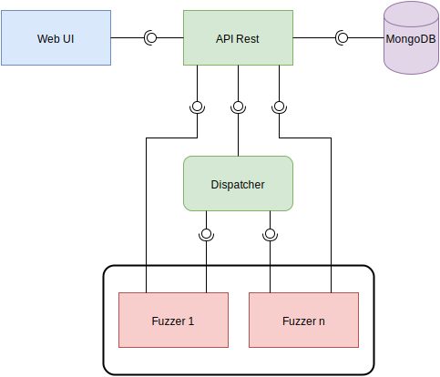

class: center, middle

# Fuzzing as a service (FAAS)

##### Frédéric Vachon, Martin Grogan et Benjamin Rosa

---
# Plan de la présentation

* Fuzzing

* État actuel du Fuzzing

* Justification et nature du changement

* Présentation de Fuzzing as a service (FAAS)

---

# Fuzzing

* Technique pour tester des logiciels basé qui l'injection de données aléatoires dans un programme

* Différents types de fuzzing :
    * Applications web
    * Protocoles réseaux
    * Fichiers exécutables

* Cette présentation sera axé sur les Fuzzers de fichiers exécutables

---
class: center, middle
# État actuel du fuzzing
---

# PeachFuzzer

* Version communautaire et version entreprise payante

* Supporte :
    * Drivers
    * Protocoles réseaux
    * Système embarqué
    * ...

* Interface web (professionel)

* Peach Pits
    * Tests préexistants qui permet de tester des failles communes

---

# American Fuzzy Lop

* Orienté pour la recherche de failles de sécurité

* Demande peu de configuration

* Interface peu conviviale en ligne de commande

* Pas d'interface web

---

# État actuel des fuzzers

* Deux catégories

* Catégorie 1
    * Gratuité
    * Interface difficile d'utilisation

* Catégorie 2
    * Produit payant
    * Interface conviviale

---
class: center, middle
# Justification et nature du changement
---

# Triangle de l'offre actuel

<svg xmlns="http://www.w3.org/2000/svg" xmlns:xlink="http://www.w3.org/1999/xlink" width="554px" version="1.1" content="&lt;mxfile userAgent=&quot;Mozilla/5.0 (Macintosh; Intel Mac OS X 10_11_6) AppleWebKit/537.36 (KHTML, like Gecko) Chrome/53.0.2785.116 Safari/537.36&quot; version=&quot;5.7.1.3&quot; editor=&quot;www.draw.io&quot; type=&quot;google&quot;&gt;&lt;diagram&gt;5VbBcpswEP0ajpkByRB8jKmbXnryoWcFLaCJQEQIg/v1XSFhYFzPZDpNe4gPWPt2tSu9t2sT0KwenzVrq++KgwxIyMeAfgkISR4TfFrg4oA4jB1QasEdFC3ASfwED4Ye7QWHbhNolJJGtFswV00DudlgTGs1bMMKJbdVW1bCDXDKmbxFfwhuKoemcbjg30CU1Vw5Cr3nheWvpVZ94+sFhBbTx7lrNufy8V3FuBpWED0GNNNKGbeqxwykpXamze37esd7PbeGxrxnA90ne3hMOcQFDYGmDz7Dmcke5itMBzWXmRyjBWtKax2GShg4tSy3rgFbAbHK1BKtCJdcaFRHqAbtRml794PPD9rAePfQ0ZUK7DBQNRh9wRC/gVDPnu+uKPX2sGhF51aqVjqRnQeZ74/ymnvhCBeepndSRn5DWSKx5KFQeKE1d8lbr2bHQze1/RMGkF07Lk5clfYbR8v0wszJ8Fwun/PeygKj2dLfGa1eIVNS6SmEJnkKL4WtL6Rc4ZxBWuSIMylKK1aOSgA6D1YngXPx5B214Pyu8q7ePDDk74hNSbwVm9yKfcXWYicfoTW9q3XXsubPtc5UcxZnYX+AFrldys8ld7zbzjbd/0+5dx802seiQJpz+OSzHUX/Tmw0l7/Vybd6daHHXw==&lt;/diagram&gt;&lt;/mxfile&gt;" onclick="(function(svg){var src=window.event.target||window.event.srcElement;while (src!=null&amp;&amp;src.nodeName.toLowerCase()!='a'){src=src.parentNode;}if(src==null){if(svg.wnd!=null&amp;&amp;!svg.wnd.closed){svg.wnd.focus();}else{var r=function(evt){if(evt.data=='ready'&amp;&amp;evt.source==svg.wnd){svg.wnd.postMessage(decodeURIComponent(svg.getAttribute('content')),'*');window.removeEventListener('message',r);}};window.addEventListener('message',r);svg.wnd=window.open('https://www.draw.io/?client=1&amp;lightbox=1&amp;chrome=0&amp;edit=_blank');}}})(this);" viewBox="0 0 554 334" style="cursor:pointer;max-width:100%;max-height:334px;"><defs/><g transform="translate(0.5,0.5)"><path d="M 157 27 L 397 182 L 157 337 Z" fill="#ffffff" stroke="#000000" stroke-miterlimit="10" transform="rotate(270,277,182)" pointer-events="none"/><rect x="217" y="2" width="120" height="60" fill="#dae8fc" stroke="#6c8ebf" stroke-width="2" pointer-events="none"/><g transform="translate(239.5,18.5)"><switch><foreignObject style="overflow:visible;" pointer-events="all" width="73" height="26" requiredFeatures="http://www.w3.org/TR/SVG11/feature#Extensibility">

Gratuit

</foreignObject><text x="37" y="19" fill="#000000" text-anchor="middle" font-size="12px" font-family="Helvetica">[Not supported by viewer]</text></switch></g><rect x="432" y="272" width="120" height="60" fill="#dae8fc" stroke="#6c8ebf" stroke-width="2" pointer-events="none"/><g transform="translate(435.5,288.5)"><switch><foreignObject style="overflow:visible;" pointer-events="all" width="111" height="26" requiredFeatures="http://www.w3.org/TR/SVG11/feature#Extensibility">

Conviviale

</foreignObject><text x="56" y="19" fill="#000000" text-anchor="middle" font-size="12px" font-family="Helvetica">[Not supported by viewer]</text></switch></g><rect x="2" y="272" width="120" height="60" fill="#dae8fc" stroke="#6c8ebf" stroke-width="2" pointer-events="none"/><g transform="translate(18.5,288.5)"><switch><foreignObject style="overflow:visible;" pointer-events="all" width="85" height="26" requiredFeatures="http://www.w3.org/TR/SVG11/feature#Extensibility">

Efficace

</foreignObject><text x="43" y="19" fill="#000000" text-anchor="middle" font-size="12px" font-family="Helvetica">[Not supported by viewer]</text></switch></g></g></svg>

---

# Nature du changement

* Nous voulons créer un produit qui pourra répondre à ces 3 critères

* Offrir une interface web conviviale

* Avoir un produit complètement gratuit

* Logiciel libre

* Notre logiciel sera efficace en terme découverte de bugs

* Nous supporterons les programmes compilés pour la plateforme Linux

---

# Autres changements

* Environnement opérationnel

    * Démocratisation de l'utilisation du fuzzing

    * Nouveaux utilisateurs à former

    * Solution : Interface web conviviale

* Support

    * Le support sera assuré par la communauté

    * Un forum de discussion sera créé pour répondre à ce besoin

---

# Changements essentiels

* Fuzzer des applications prenant des entrées en ligne de commande

* Interface web facile d’utilisation

* Pouvoir rédiger les fichiers en entrée (hex editor)

* Consulter les tâches de fuzzing (en cours, à l’arrêt, terminée)

* Consulter les rapports de crash

* Lancer plusieurs activités de Fuzzing simultanément

---

# Changement essentiels (suite)

* Utiliser la technologie des conteneurs de Docker plutôt qu’une machine virtuelle

* Avoir un répartiteur qui va répartir les tâches de Fuzzing entre les conteneurs

* Base de données qui va entreposer les rapports de crash

* Pouvoir chercher un rapport de crash dans la liste des rapports

* Pouvoir chercher une tâche de fuzzing dans la liste des tâches

---
class: center, middle
# Présentation de Fuzzing as a service (FAAS)
---

# Objectifs

* Vise les développeurs indépendants et les petites à moyennes entreprises

* Améliorer la qualité et la sécurité des logiciels pour les acteurs qui n'ont pas d'immense budget à investir

* Inciter les gens à intégrer le fuzzing dans le cycle du développement de leur logiciel

* Démocratiser la pratique du fuzzing

    * Produit gratuit

    * Facile d'utilisation
        

---

# Politiques opérationnelles et contraintes

* Deux contraintes importantes :

    * Architectures supportées :

        * Support des architectures x86 et x86_64 uniquement

        * Pas de support pour MIPS, ARM, PowerPC, etc.

    * Plateformes supportées :
        
        * Support de la plateforme Linux uniquement

        * Pas de support pour Android, MacOS, iOS, Windows, etc.

---

# Principales composantes du système

.center[]

---

# Fonctionnalités de FAAS

* Fuzzer les données en entrée standards

* Fuzzer les arguments du programme

* Fuzzer les fichiers lus par le programme

* Fuzzer les variables d’environnement

* Créer, éditer, supprimer une ou plusieurs  tâche de fuzzing depuis l’interface web

* Consulter la liste des rapports de crash depuis l’interface web

* Consulter la liste des tâches de fuzzing (celle à l’arrêt, en cours ou terminée).

---

# Fonctionnalités de FAAS (suite)

* Se connecter et se déconnecter sur son compte utilisateur

* Stocker les rapports de crash dans une base de donnée

* Lancer plusieurs activités de fuzzing au moyen d’un conteneur Docker

* Créer ses propres données d’entrée au moyen d’un Hex Editor, via l’interface web

* L’utilisateur doit pouvoir consulter et mettre à jour ses données de profil

* Pouvoir chercher une tâche de fuzzing dans la liste des tâches

* Pouvoir chercher un rapport de crash dans la liste des rapports

---

# Conclusion

* FAAS

	* Démocratiser le Fuzzing

	* Intégrer le Fuzzing dans le cycle de vie du logiciel

	* Solution conviviale, efficace et gratuite

