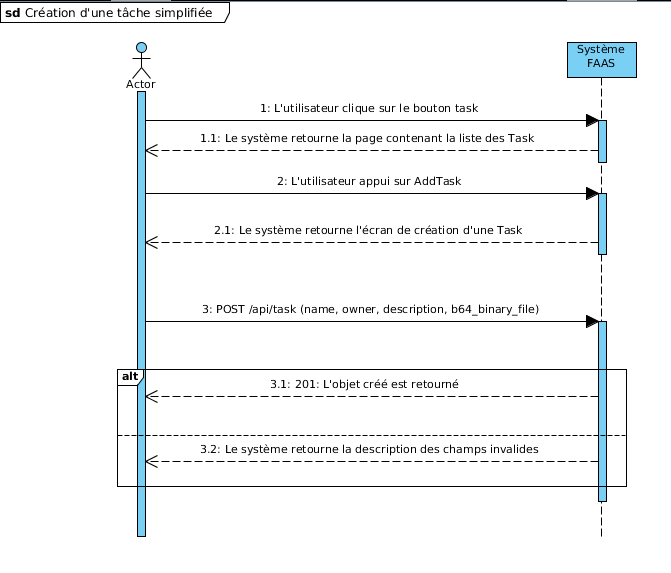
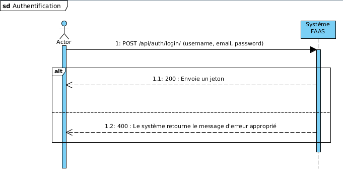

class: center, middle

# Fuzzing as a service (FAAS)

##### Frédéric Vachon, Martin Grogan et Benjamin Rosa

---

# Fuzzing as a service (FAAS)

* Améliorer la qualité et la sécurité des logiciels pour les acteurs qui n'ont pas d'immense budget à investir

* Inciter les gens à intégrer le fuzzing dans le cycle du développement de leur logiciel

* Démocratiser la pratique du fuzzing

    * Produit gratuit

    * Facile d'utilisation

---

# Principales fonctionnalités

* Lancer des tâches de Fuzzing

* Consulter les tâches en cours

* Consulter les rapports de crash

* Définir une grammaire balisant les données à générer

---

## Contenu des sprints

* Sprint 1
	* Préparer l’environnement de développement
	* Le visiteur peut se créer un compte utilisateur 
	* L’utilisateur peut se connecter et se déconnecter de l’application
	* L’utilisateur peut créer une tâche de fuzzing simplifiée ne contenant que le programme à tester

* Sprint 2

	* L’utilisateur peut démarrer une tâche de fuzzing en définissant une grammaire de base pour injecter des données dans un programme
	* L’utilisateur peut fuzzer un programme via l’entrée standard
	* L’utilisateur peut consulter la liste des rapports de crash
	* L’utilisateur peut consulter la liste des tâches de fuzzing

* Sprint 3
	* L’utilisateur peut consulter les détails d’un crash
	* L’utilisateur peut consulter les détails d’une tâche de fuzzing
	* L’utilisateur peut forcer l’arrêt d’une tâche de fuzzing

---

# Sprint backlog

* Préparer l’environnement de développement	
	* Créer un conteneur avec React JS et un serveur web :	6 heures	
	* Créer un conteneur avec Django pour l’API REST :	4 heures	
	* Créer un conteneur pour contenir la base de donnée :	4 heures
	* Assembler les conteneurs en utilisant Docker-Compose :	1 heure

* Créer un compte utilisateur	
	* UX: créer le design de l’écran de création de compte :	1 heure
	* Front-end : implémenter l’écran de création de compte :	4 heures	
	* Back-end : créer le service de création de compte, créer une table utilisateur dans la base de donnée :	5 heures	

---

# Sprint backlog (suite)

* Se connecter et se déconnecter sur son compte utilisateur	
	* Front-end : implémenter l’écran d’interface permettant de se connecter à l’application :	5 heures	
	* UX : créer le design de l’écran de connection :	1 heure
	* Back-end : créer le service d’authentification :	8 heures	

* Créer une tâche de fuzzing simplifié	
	* UX: créer le design de l’écran création de tâche de fuzzing :	1 heure
	* Front-end : implémenter l’écran de création de tâche :	5 heures
	* Back-end : créer le service de création de tâche, création d’une table tâche dans la base de donnée :	8 heures	

---
## Use case: Créer une tâche simplifiée

1. L’utilisateur se trouve sur l’écran d’accueil de l’application et clique sur le bouton Task.

2. Le système retourne un écran contenant la liste des Task

3. L’utilisateur appuie sur le bouton Add task

4. Le système retourne l’écran de création de tâche

5. L’utilisateur entre les informations (nom, description) et téléverse un fichier binaire puis appuie sur le bouton ok

6. Le serveur valide les champs et crée une nouvelle tâche dans la base de donnée puis renvoie un code de succès

7. Le système affiche l’écran d’accueil

---

# Créer une tâche simplifiée

---

# Use case: Authentification

1. le Visiteur remplit les champs suivants et clique sur le bouton : 
 - Nom utilisateur
 - Mot de passe
2. Le système analyse la requête, cherche et trouve l’utilisateur dans la base de donnée et retourne les informations le concernant à l’interface web
3. le Visiteur devenu Utilisateur a maintenant accès à sa page personnelle.

---

# Contrats simplifiés

* Authentification d'un utilisateur
	* POST /api/auth/login (username: String, email: String, password: String)
	* Retourne le code 200 et un jeton (String)
	* Préconditions: Username et password requis
	* Postcondition: Un token est créé dans la base de données

* Créer une tâche de fuzzing
	* POST /api/task (name: String, owner: String, description: String, b64_binary_file: String)
	* Retourne code 201 et l'objet créé
	* Précondition: owner et b64_binary_file requis
	* Postcondition: Nouvelle tâche créée dans la base de données

---

# Diagramme de classe

---

### Revue de sprint

#### Revue technique

\+ Tâches accomplies dans les temps prévus

\- Complexité de l'architecture système : Temps considérable de mise en place

\- Tergiversation sur les choix technologiques

#### Revue gestion

\+ Bon transfert de connaissance entre les membres de l'équipe

\- Commencement tardif du travail

#### Améliorations prévues

* Commencer le travail dès le jour 1 du sprint
* Prévoir des heures pour se former sur les technologies
---

### Plan du prochain sprint

1. Démarrer une tâche de fuzzing en définissant une grammaire de base pour générer les données à injecter
	- 30 heures

2. Fuzzer un programme via l’entrée standard afin de pouvoir tester et détecter d’autres failles potentielles de mon programme.
	- 10 heures

3. Consulter la liste des rapports de crash
	- 20 heures

4. Consulter la liste des tâches de fuzzing
	- 10 heures

---

class: center, middle
# Démo
