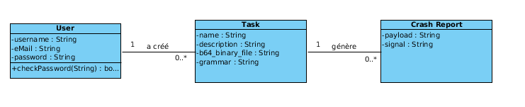
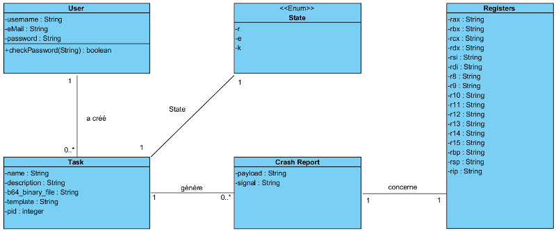

class: center, middle

# Fuzzing as a service (FAAS)

##### Frédéric Vachon, Martin Grogan et Benjamin Rosa

---

# Fuzzing as a service (FAAS)

* Améliorer la qualité et la sécurité des logiciels pour les acteurs qui n'ont pas d'immense budget à investir

* Inciter les gens à intégrer le fuzzing dans le cycle du développement de leur logiciel

* Démocratiser la pratique du fuzzing

    * Produit gratuit

    * Facile d'utilisation

---

# Principales fonctionnalités

* Lancer des tâches de Fuzzing

* Consulter les tâches en cours

* Consulter les rapports de crash

* Définir une grammaire balisant les données à générer


---

## Contenu des sprints


* Sprint 1
	* Préparer l’environnement de développement
	* Le visiteur peut se créer un compte utilisateur 
	* L’utilisateur peut se connecter et se déconnecter de l’application
	* L’utilisateur peut créer une tâche de fuzzing simplifiée ne contenant que le programme à tester

* Sprint 2
	* Démarrer une tâche de fuzzing en définissant une grammaire de base pour injecter des données dans un programme.
	* Fuzzer un programme via l’entrée standard.
	* Consulter la liste des rapports de crash.
	* Consulter la liste des tâches de fuzzing.

* Sprint 3
	* Consulter les détails d’un crash
	* Consulter les détails d’une tâche de fuzzing
	* Forcer l’arrêt d’une tâche de fuzzing

---

# Contenu du sprint actuel

* Consulter les détails d’un crash

* Consulter les détails d’une tâche de fuzzing

* Forcer l’arrêt d’une tâche de fuzzing

---

# Diagramme de classe

```


```


---

# Diagramme de classe

```


```


---

# Diagramme de classe

```


```



---

class: center, middle

# Démo
---

### Revue de sprint

#### Revue technique

\+ Tous les cas d'utilisation du sprint actuel ont été complétés

\- Contrainte temporelle fait qu'on a dû utiliser un design architectural moins robuste

\- Difficulté à débogguer du code transpilé


#### Revue gestion

\+ Début du sprint dès le premier jour (no joke!)

\+ Bonne communication au sein de l'équipe


---

class: center, middle

# Revue de projet
---

# Revue technique

\+ Le product backlog a été implémenté au complet

\+ Bon choix des technologies (ReactJS/Redux et Django)

\+ Excellent choix de Docker pour notre environnement de développement (Chaque membre développait sur une plateforme différente (Windows, Linux, MacOS))

\- Le framework du fuzzer (Kitty) est limité en terme de documentation et la communauté est restreinte

\- Tergiversation aux niveaux du choix technologique en début de projet


---

# Revue de gestion

\+ Bon investissement de tous les membres de l'équipe

\+ Bonne disponibilité des membres, malgré les conflits d'horaire

\+ Bon choix des outils communicationnels pour palier aux conflits d'horaires

\+ Bon transfert des connaissances entre les membres de l'équipe

## Amélioration à prévoir

Plus de rencontres physiques auraient accéléré l'échange d'information

---

# Bénéfices apportés par le développement Agile

* Revue de sprints ont permis à l'équipe de s'améliorer tout au long du projet

* Les sprints ont permis de nous obliger à mieux répartir la tâche de travail tout au long de la session

* L'Agilité nous a permis de définir notre vélocité ce qui nous permet d'adapter la charge de travail d'itération en itération


